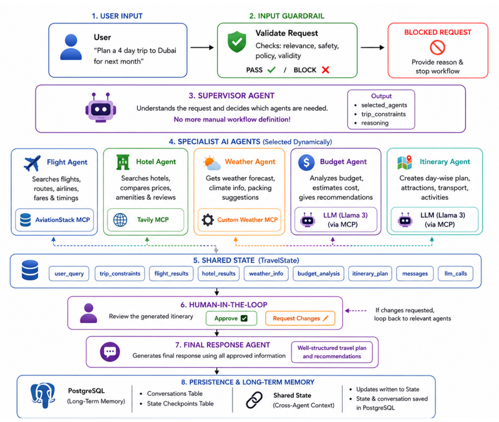
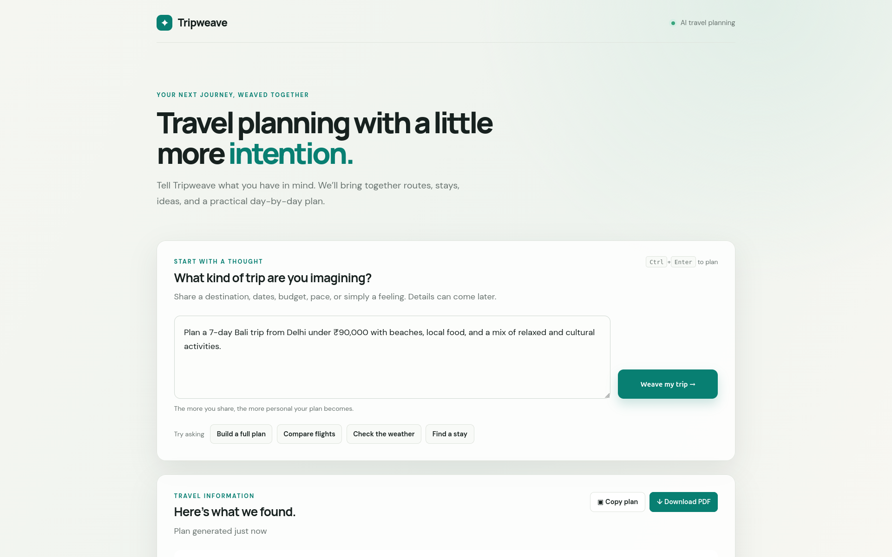

# TripWeave: Multi-Agent Travel Planner

TripWeave is an AI-powered travel-planning application that turns a
natural-language request into focused travel research, a constraint-aware
itinerary draft, and a reviewable final response.

It is built as a Python modular monolith using FastAPI, LangGraph, Groq,
Model Context Protocol (MCP) integrations, and PostgreSQL-backed workflow
checkpoints.

---

## 1. Methodology

TripWeave uses a request-aware multi-agent workflow rather than sending every
request through the same fixed prompt.

```text
User request
     │
     ▼
FastAPI API
     │
     ▼
LangGraph workflow
     │
     ▼
Supervisor and travel guardrail
     │
     ├── Flight agent ──► AviationStack MCP
     ├── Hotel agent  ──► Tavily MCP
     ├── Weather agent ─► OpenWeather MCP
     ├── Budget agent ──► Groq LLM
     └── Itinerary agent ─► Groq LLM
                                  │
                                  ▼
                         Human approval interrupt
                                  │
                                  ▼
                            Final response
```

### Architecture diagram



### Agent responsibilities

| Component | Responsibility |
| --- | --- |
| Supervisor | Determines whether the request is travel-related and selects the required agents |
| Flight agent | Searches live flight and route information |
| Hotel agent | Researches accommodation and travel information |
| Weather agent | Retrieves current weather and a short forecast |
| Budget agent | Analyzes estimated costs, feasibility, and trade-offs |
| Itinerary agent | Creates a day-by-day itinerary draft |
| Human approval | Lets the user approve the draft or request changes |
| Final agent | Produces the final answer within the requested scope |

### Technology stack

| Layer | Technology |
| --- | --- |
| Backend API | FastAPI + Uvicorn |
| Agent orchestration | LangGraph |
| Language model | Groq through LangChain |
| Tool integration | Model Context Protocol (MCP) |
| Flight data | AviationStack |
| Web research | Tavily |
| Weather data | OpenWeather |
| Persistence | PostgreSQL + LangGraph checkpointing |
| Frontend | HTML, vanilla JavaScript, and CSS |

---

## 2. Description

TripWeave accepts requests such as:

> Plan five days in Goa from Delhi under ₹40,000 with beaches, local food, and
> a relaxed pace.

The workflow extracts the user’s requested scope and constraints, then invokes
only the relevant specialist capabilities. A focused question such as “What
will the weather be like in Tokyo next week?” does not automatically trigger
hotel research or itinerary generation.

For a complete itinerary request, TripWeave:

1. Extracts the destination, origin, duration, budget, and preferences.
2. Retrieves relevant flight, accommodation, and weather information.
3. Generates a draft itinerary.
4. Pauses for human approval.
5. Revises the draft when feedback is provided.
6. Returns a final response after the workflow resumes.

### MCP integration

```text
Agent
  │
  ▼
mcp_client.py
  ├── Tavily hosted MCP
  ├── AviationStack local MCP server
  └── Weather local MCP server
        │
        ▼
   External provider APIs
```

The local MCP adapters are:

- `flight_mcp_server.py`
- `weather_mcp_server.py`

The workflow state is checkpointed in PostgreSQL so an approval request can be
resumed using the same `thread_id`.

---

## 3. Input / Output

### Input

TripWeave accepts a natural-language travel request through the web interface
or the API.

Example:

```json
{
  "message": "Plan 5 days in Goa from Delhi under ₹40,000 with beaches and local food"
}
```

It also accepts an approval or revision request for an existing workflow:

```json
{
  "thread_id": "user_<thread-id>",
  "approved": false,
  "feedback": "Make day two slower and add more local food."
}
```

### Output

The API returns a JSON response containing fields such as:

```json
{
  "success": true,
  "thread_id": "user_<thread-id>",
  "answer": "Your final travel response...",
  "requires_approval": true,
  "approval_request": "Approve this itinerary or provide feedback.",
  "selected_agents": [
    "flight_agent",
    "hotel_agent",
    "weather_agent",
    "budget_agent",
    "itinerary_agent"
  ],
  "trip_constraints": {
    "destination": "Goa",
    "origin": "Delhi",
    "duration": "5 days",
    "budget": "₹40,000"
  },
  "constraint_warnings": []
}
```

---

## 4. Live link


Live: https://tripweave.dheerajbhaskar.dev


---

## 5. Screenshot of the Interface




---

## Current limitations

- Flight lookup provides live/status information, not reliable ticket-fare
  comparison.
- Flight, hotel, and weather retrieval currently follow the configured graph
  sequence instead of running concurrently.
- Provider results are primarily passed between agents as text.
- Deterministic checks for schedule overlap, opening hours, transfer time, and
  total budget are planned but are not yet a separate validation layer.
- The repository currently has no automated test suite.

---

